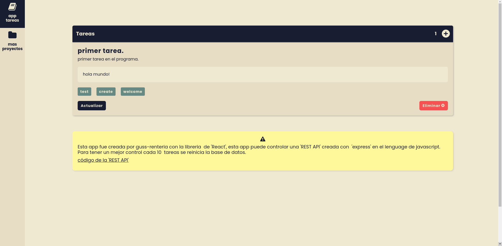

# **API con React**

Este proyecto se creo usando [Create React App](https://github.com/facebook/create-react-app).\
Este proyecto hace uso de [Redux](https://redux.js.org/) para un mejor manejo de las tareas.

#### **[+] Preview**
>**App frontend**\
[tareas-react-frontend](https://tareas-react-frontend.vercel.app/)

>**backend**\
[tareas-nodejs-backend](https://tareas-nodejs-backend.herokuapp.com/)

#### **[+] Scripts disponibles**
```shell
yarn start
```

Ejecuta la aplicación en el modo de desarrollo.\
Abra [http://localhost:3000](http://localhost:3000) para verlo en su navegador.

La página se volverá a cargar cuando realice cambios.\
También puede ver las advertencias de codigo en la consola.

```shell
yarn test
```

Ejecuta la aplicación en el modo de testeo.\
Consulte la sección [ejecución de pruebas](https://facebook.github.io/create-react-app/docs/running-tests) para obtener más información.

```shell
yarn build
```

Construye la aplicación en la carpeta `build`.\
Empaqueta correctamente 'React' en modo de producción y optimiza la compilación para obtener el mejor rendimiento.

La compilación se minimiza y los nombres de archivo incluyen los hashes.\
¡Tu aplicación está lista para ser implementada!

Consulte la sección [implementación](https://facebook.github.io/create-react-app/docs/deployment) para obtener más información.

#### **[+] Screenshot**


#### **[+] Aprende más**
Puede obtener más información en la [documentacion de Create React App](https://facebook.github.io/create-react-app/docs/getting-started).

Para aprender React, consulte la [documentación de React](https://reactjs.org/).
